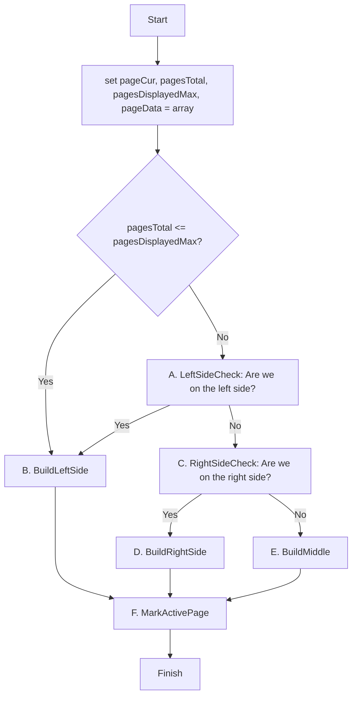

This document describes the decisions, made when planning the pagination elements.

# 1. Basics

## a) Navigation bar

Lets say, you want to display a navigation bar, that always shows 5 links, if there are 5 ore more pages available:

```1 | 2 | 3 | 4 | 5```

Let us also say, we have 20 pages.

Let us also say, the number of elements sould always be uneven.

## b) Positions

We have to determine, where in the navigation we are, and what should happen at this position.

* When we are on a page from 1 to 3, we want the navigation to be displayed like that:<br />
```1 | 2 | 3 | 4 | 5 ```<br />
Let us call that **Left Side Navigation**.

* When we are on a page number, greater than 3, we want the current page number to be in the middle of the bar. If we are on page 7, for example, it would be:<br />
```5 | 6 | 7 | 8 | 9```<br />
Let us call that **Middle Navigation**.

* When we are on page 18, 19 or 20, we always want to have a display like that:<br />
```16 | 17 | 18 | 19 | 20```<br />
Let us call that **Right Side Navigation**.

---

# 2. Calculation

The general calculation of the pagination can be seen in this flowchart. The numbered parts in the flowchart are explained in sections below.



---

## A) LeftSideCheck

We have to check, if the current page makes the navigation display the links from page 1 to the current page like that.

```1 | 2 | 3 | 4 | 5```

The left side navigation is true for the formula:

```page <= floor(numberOfPagesToDisplay / 2)```

## B) BuildLeftSide

This can be done by a simple for loop.

```
pageObjects = new PageObjects();

for(i = 1; i < pagesToDisplay; i++) {
    pageObject = new PageObject(number: i);
    pageObjects.append(i);
}
```

```PageObjects``` is a datastructure that holds individual pages of type ```PageObject``` in the order they have been added. So it behaves like an array, where you append new entries.

## C) RightSideCheck

We have to check, if the current page makes the navigation display the links from page 1 to the current page like that, when we have an amount of 20 pages, and are on page 18, 19 or  20.

```16 | 17 | 18 | 19 | 20```

The right side navigation is true for the formula:

```page > pages - ceil(numberOfPagesToDisplay / 2)```

## D) BuildRightSide

There are different approaches. What I do:

1. Calculate the offset:<br />
```offset = numberOfPages - numberOfPagesToDisplay```

2. Build the object, like in *B) BuildLeftSide*, but with the offset as our start position:

```
pageObjects = new PageObjects();

for(i = offset; i < pagesToDisplay; i++) {
    pageObject = new PageObject(number: i);
    pageObjects.append(i);
}
```

## E) BuildMiddle

In the middle part, I choose an approach similar to *D) BuildRightSide*.

1. Calculate the offset:<br />
```offset = page - floor(numberOfPagesToDisplay / 2)```

2. Build the object exactly like in section *D.2*.

## F) MarkActivePage

To mark the active page, I let the program walk through the collection of pages that have been built before. When it finds the current page, it just flags it.

Of course I could do this check already in the functions before and save me the extra loop through the array. But I want to keep the other code as clean and simple as possible, since it is the part, that is harder to understand.

I also could do the check in the template. But since I already split things up in code and template, I also do it with this part, to be consistant in my decisions.

---

# 3. Reusable code

The formula for generating the pages can be extracted into a function, since it is always the same formular. If we are in the left side navigation, we can just enter page number 1 for the offset, and we are done.

---

# 4. Middleware

Having talked about consistency before, here I have not been consistent, I think.

When I planned this, I thought about the right position for this code. It is not really a controller code or service code. But it also does not really belong to the template.

So a good decision would be, to extend the template engine (twig) with a function, that can do this calculations for me.

Maybe I will choose this approach in a later version of the project.

For now, I define a service for it.